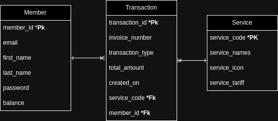

# API Documentation

This document provides an overview of the routes available in the application.

# Screenshots ERD

 <tr>
    <td> </td>
  </tr>

## Routes Overview

### Member Routes

#### `GET /member`
- **Description:** Retrieves all members.
- **Controller:** `memberController.getAllMember`

#### `POST /member/register`
- **Description:** Registers a new member.
- **Controller:** `memberController.registerMember`

#### `POST /member/login`
- **Description:** Logs in an existing member.
- **Controller:** `memberController.loginMember`

### Service Routes

#### `GET /service`
- **Description:** Retrieves all services.
- **Controller:** `serviceController.getAllService`

#### `POST /service`
- **Description:** Creates a new service.
- **Controller:** `serviceController.createServices`

### Transaction Routes

#### `GET /transaction/saldo/:id`
- **Description:** Checks the balance of a member.
- **Controller:** `transactionController.saldoCheck`
- **Middleware:** `protect` (Authentication required)

#### `POST /transaction/topup/:id`
- **Description:** Tops up the balance of a member.
- **Controller:** `transactionController.saldoTopUp`
- **Middleware:** `protect` (Authentication required)

#### `POST /transaction/:id`
- **Description:** Makes a transaction for a member.
- **Controller:** `transactionController.transactionService`
- **Middleware:** `protect` (Authentication required)

#### `GET /transaction/history`
- **Description:** Retrieves all transaction or history.
- **Controller:** `transactionController.history`
- **Middleware:** `protect` (Authentication required)

## Middleware
- **`protect`**: Ensures that the user is authenticated before accessing protected routes.
---
## Postman API Documentation

For detailed examples and testing of the API, please visit the Postman documentation via the following link:

[Postman API Documentation](https://documenter.getpostman.com/view/27926114/2sA3s9EUjT)

---

Feel free to update this documentation as needed to reflect any changes in your routes or controllers.
